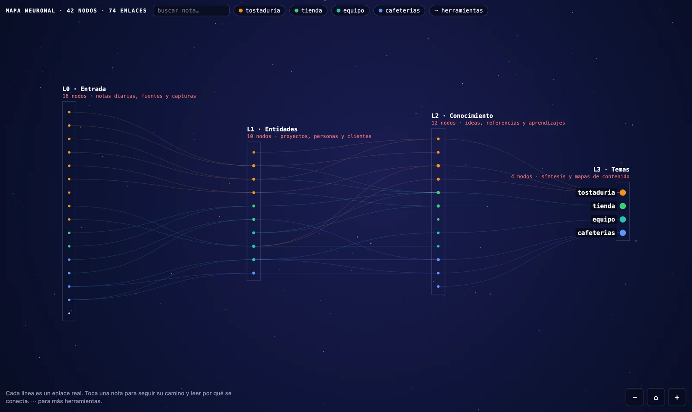
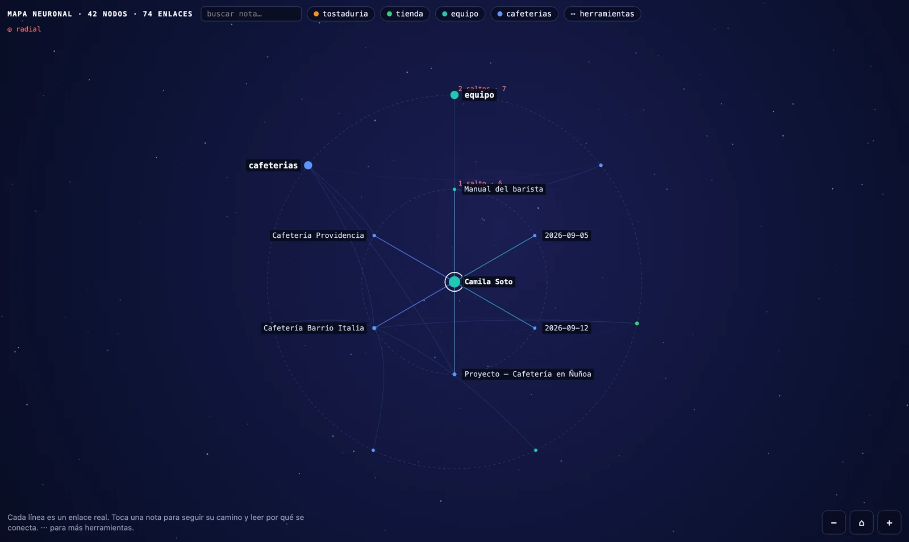
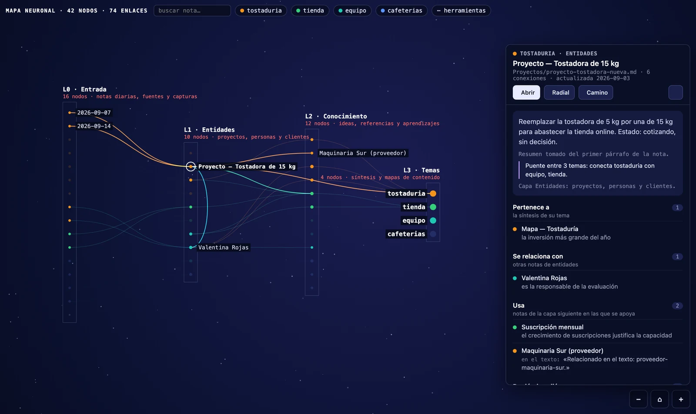
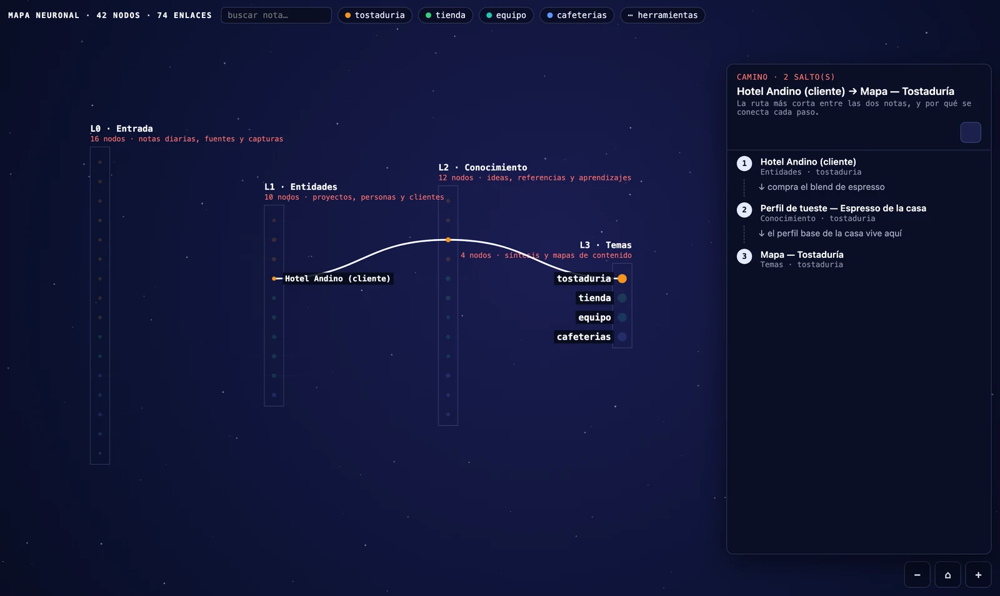
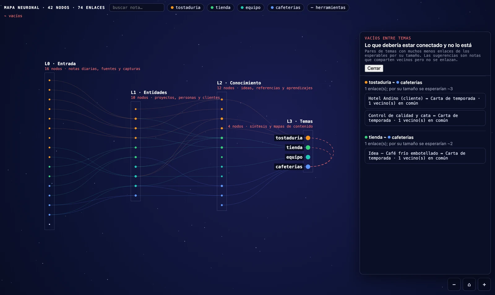
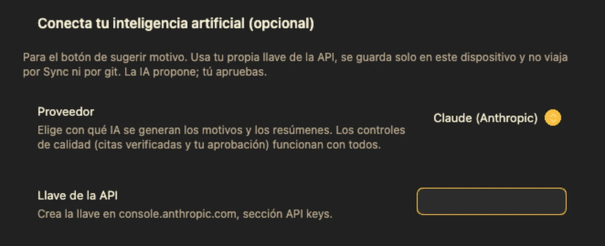

# Mapa neuronal

*Español · [Read in English](README.md)*

**Mira tu vault como una red neuronal por capas, y lee *por qué* cada nota se conecta
con la siguiente.**

El grafo de Obsidian te muestra *que* dos notas están enlazadas. Nunca te dice *por qué*.
Con unos cientos de notas es una madeja: bonita, e inútil para pensar.

Mapa neuronal ordena tus notas en capas, de izquierda a derecha, como la información se
mueve de verdad en una base de conocimiento: lo que entra → de qué se trata → lo que
aprendiste → en qué se sintetiza. Toca cualquier nota y obtienes la frase en la que se
escribió el enlace. No una suposición: la línea real de tu propia nota.



## Cómo funciona


Todo lo que está dentro del recuadro pasa en tu computador, sin una sola llamada de red.
A la IA se la llama solo cuando pides una sugerencia, con tu llave; y lo que proponga
tiene que sobrevivir la verificación de sus citas por código y tu aprobación antes de que
se escriba una línea en tu nota. La versión interactiva del diagrama está en
[`docs/diagramas/mapa-neuronal.html`](docs/diagramas/mapa-neuronal.html): descárgalo y
ábrelo en un navegador.

## Qué hace

- **Capas, no una madeja.** Tú decides qué carpetas van en cada capa (un asistente
  propone una en el primer uso). Dentro de cada capa las notas se ordenan para que se
  cruce la menor cantidad de líneas, así los caminos que ves son los que existen.
- **Cada enlace lleva su motivo.** Toca un enlace y el panel muestra el motivo que
  curaste (`- [[nota]] — motivo`) o la frase real de la nota donde aparece el enlace.
  Nada se inventa.
- **Caminos.** Eliges dos notas y dibuja la cadena más corta entre ellas, paso a paso,
  con el motivo de cada salto. Así te enteras de que dos proyectos que creías
  relacionados están a cuatro saltos.
- **Vacíos.** Compara los enlaces que existen contra los que cabría esperar entre dos
  temas (vecinos comunes, densidad) y nombra los pares que deberían estar conectados y
  no lo están. En mi propio vault encontró dos temas con 0 enlaces donde se esperaban ~26.
- **Vista radial.** Centra una nota y mira su mundo en anillos: vecinos directos, luego
  los de ellos. La animación viaja hacia fuera, anillo por anillo.

  
- **Motivos con *tu* IA (opcional).** Si conectas un proveedor, propone un motivo para
  los enlaces que no lo tienen — siempre con una cita literal de las dos notas, siempre
  verificada por código, y nunca escrita en tus notas hasta que la apruebas.
- **Inglés y español.** La interfaz sigue el idioma configurado en Obsidian.
- **Funciona en el teléfono.** El mismo mapa, las mismas proporciones, gestos táctiles.
- **Exportar.** PNG para presentaciones, un Canvas de Obsidian que puedes seguir
  editando, o una página HTML independiente.

## Instalación

Complementos de la comunidad → Explorar → buscar "Mapa neuronal" → Instalar → Activar.

A mano: baja `main.js`, `manifest.json` y `styles.css` de la última release a
`<vault>/.obsidian/plugins/mapa-neuronal/` y actívalo en Complementos de la comunidad.

Se abre con el comando **Abrir mapa neuronal** (`Cmd/Ctrl+P`) o el ícono de cerebro en
la barra izquierda.

## Primer uso, en un minuto

1. Abre el mapa. Un asistente lista tus carpetas con una capa propuesta para cada una
   (Entrada / Entidades / Conocimiento / Temas / No mostrar). Corrige lo que se vea mal
   y presiona Aplicar.

   

2. Toca cualquier nota. El panel lateral nombra su capa, su tema, un resumen de dos
   líneas y todos sus enlaces con su motivo.

   

3. `···` → **Camino entre dos notas**, eliges dos, y lees la cadena.

   

4. `···` → **Vacíos entre temas**, para ver lo que debería estar conectado y no lo está.

   

Eso es todo. No hay que configurar nada más, y nada de lo anterior necesita una llave de IA.

El resto vive en el menú de herramientas — la ficha `⋯ herramientas` del mapa, o el `···`
de la pestaña:


## Ajustes que vale la pena conocer

| Ajuste | Qué cambia |
|---|---|
| **Capas** | Una línea por capa: `Nombre \| descripción`. Tres a cinco funciona mejor. |
| **Carpetas** | Qué carpeta va en qué capa. El asistente lo escribe por ti. |
| **Propiedad de tema** | La propiedad del frontmatter que agrupa y colorea (por defecto `tema`). Vacío = sin temas. |
| **Notas visibles por capa** | En vaults grandes cada capa muestra sus notas más conectadas; el resto aparece al buscarlas. Por defecto 150. |
| **Sección de conexiones** | El título al final de cada nota donde se escriben los motivos aprobados. |
| **Propiedad de enlaces externos** | Propiedades del frontmatter con enlaces web (`Título \| https://…`, `https://…`, `usuario/repo`). Vacío = la sección no aparece. Solo abre `http` y `https`. |
| **Propiedad de fecha** | Si la llenas, al aprobar un motivo también se escribe la fecha de hoy en esa propiedad. Vacía por defecto: el plugin no toca tu frontmatter. |
| **Animación** | Pulsos de luz por los enlaces. Solo con el mapa visible, y apagada si el sistema pide reducir movimiento. |

## Conecta tu propia IA (opcional)

El mapa funciona sin IA. Si conectas una, puede proponer motivos para los enlaces que no
lo tienen y resúmenes cortos para las notas sin descripción.

Compatibles: **Anthropic (Claude)**, **OpenAI**, **Google (Gemini)** y cualquier
**servidor local compatible con OpenAI** (Ollama, LM Studio, LocalAI) — el local no
necesita llave ni internet.

Los motivos y los resúmenes se escriben **en el idioma de tus notas**, no en el idioma de
la interfaz.



Configurarla son cuatro campos: eliges el proveedor, pegas tu llave, eliges el modelo y
aprietas **Probar la conexión** — una llamada mínima que te dice si responde, sin enviar
ninguna nota. La llave queda solo en ese dispositivo.

Tres reglas que el plugin impone con cualquier proveedor:

1. **Las citas las verifica el código.** El modelo tiene que devolver una cita literal de
   cada una de las dos notas. El plugin busca esas citas en los archivos. Si una no
   está, la propuesta queda marcada como no verificable y no se puede aprobar. Eso es lo
   que frena la invención con tono seguro.
2. **Una segunda pasada revisa a la primera.** Otra llamada compara el motivo con las
   citas buscando negaciones, estados y pendientes ("decidimos no usar X" no puede
   volverse "usamos X"). Se puede apagar; cuesta el doble y atrapa los errores de matiz.
3. **Nada se escribe sin ti.** Aprobar es un clic. Solo entonces el motivo entra en tu
   nota, bajo el título que configuraste, y solo como una línea nueva — el plugin nunca
   reescribe texto existente.

Cada aprobación queda registrada (fecha, modelo, citas, texto final) en una nota dentro
de la carpeta de auditoría.

### Precisión medida

En un vault real de 254 notas y 916 enlaces, sobre una muestra reproducible de 44
enlaces revisados a ciegas contra las notas fuente:

| | Correctos | Erróneos o inventados | No verificables (bloqueados) |
|---|---|---|---|
| Primer intento: modelo pequeño, solo la frase del enlace | 48 % | 16 % | — |
| Método actual: notas completas + citas verificadas + segunda pasada | **97,7 %** | **0 %** | 2,3 % |

Se midió con **Claude Opus 5**. Con otros modelos los candados siguen puestos — una
propuesta sin citas verificables sigue sin poder aprobarse — pero la tasa de acierto no
está medida: trátala como desconocida hasta que la midas en tu propio vault.

### Costo y privacidad

- Tus notas van al proveedor que **tú** eliges, con **tu** llave, a **tu** costo. El
  plugin no tiene servidor. El autor nunca ve tus notas, tus llaves ni tus consultas.
- Las llaves se guardan por dispositivo en el almacenamiento local de Obsidian — nunca
  en `data.json`, así que no viajan por git, Obsidian Sync ni un respaldo.
- No se envía nada hasta que pides una sugerencia. Abrir el mapa, navegar, caminos y
  vacíos no hacen ninguna llamada de red.
- Costo aproximado por sugerencia con Claude Opus 5: dos notas de contexto más la
  revisión. Un vault con cien enlaces sin motivo cuesta unidades de dólar recorrerlo
  completo — y no hay que hacerlo de una sola vez.
- El proveedor local (Ollama) no manda nada a ninguna parte: sin llave, sin internet,
  sin costo.

## Vaults grandes

Probado con 5.043 notas y 17.526 enlaces. Cada capa dibuja sus notas más conectadas (150
por defecto) y revela el resto a pedido, así el mapa sigue siendo navegable en vez de
dibujar un rectángulo gris. En radial cada anillo se limita a 80.

## ¿Modifica mis notas?

Solo cuando presionas **Aprobar** en una sugerencia de IA, y solo como una línea agregada
en la sección de conexiones de esa nota. El texto que ya estaba nunca se reescribe ni se
reordena, y tu frontmatter no se toca salvo que llenes el ajuste *Propiedad de fecha*,
que viene vacío.

Todo lo demás — capas, colores, caminos, vacíos — es de solo lectura. La otra escritura
posible es exportar: un PNG en la carpeta que elijas.

No hay telemetría, ni analítica, ni servidor: el plugin no hace ninguna llamada de red
salvo la de la IA que tú pides, al proveedor que configuraste.

## Cómo se ve

El mapa se dibuja sobre un lienzo oscuro con tema claro y con tema oscuro — como un cielo
de noche, para que los colores de los temas y los pulsos de luz de los enlaces se lean.
El panel, las fichas y los ajustes siguen tu tema.

## Construir desde el código

Todo sale de `src/`; el release es una sola pasada de esbuild, sin minificar.

```bash
npm install
npm test        # construye src/main.js → main.js y revisa las traducciones
npx eslint src/ # el linter oficial de plugins de Obsidian
./instalar-en-vault.sh /ruta/a/tu/vault
```

`src/main.js` es el código fuente. El `main.js` de la raíz es el resultado del build y no
se versiona: viaja en los releases. El build es una sola pasada de esbuild, sin minificar,
así que el archivo publicado sigue siendo legible.

## Licencia

[MIT](LICENSE). Gratis para cualquier uso —personal o comercial— y puedes forkearlo,
modificarlo y redistribuirlo, conservando el aviso de autoría.

El plugin no cobra nada y no tiene versión de pago. El directorio de Obsidian igual lo
etiqueta como **pagos opcionales**, porque puede conectarse a servicios de IA que te
cobran a ti con tu propia llave; el proveedor local (Ollama, LM Studio) no cuesta nada.

## Soporte

Errores e ideas: issues de GitHub. Incluye tu versión de Obsidian, tu plataforma y la
cantidad de notas y enlaces que muestra el encabezado del mapa.

---

Hecho por **Felipe Córdova** · Powered by [DBB Labs](https://dontbuybuild.cl) — *No compres. Construye.*
